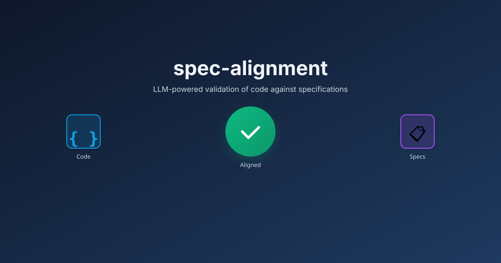

<div align="center">


# spec-alignment

**LLM-powered validation of code against specifications**

[](https://github.com/ebellefontaine/spec-alignment/releases)
[](https://github.com/ebellefontaine/spec-alignment/actions)
[](LICENSE)
[](https://www.typescriptlang.org/)

</div>



A GitHub Action that validates whether code changes in pull requests align with your project's specifications using LLM-based judgment.

## Problem

Teams write specs (feature specs, PRDs, functional requirements docs) using a variety of tools and conventions, but nothing checks whether a pull request's actual code changes stay consistent with — or in scope of — those specs. Drift between spec and implementation is discovered late, if at all, usually by a human reviewer who has to hold the whole spec in their head while reading a diff.

## Solution

spec-alignment reads your configured spec documents, analyzes the PR's diff, and uses an LLM (your choice of provider) to judge whether the changes are consistent with and in scope of those documents. Results are reported via GitHub's Checks API and optional PR review comments.

## How It Works

1. **Specs are read from your repo** — Supports Spec Kit, OpenSpec, Kiro, BMAD-METHOD, domain-modeling convention, or custom files
2. **PR changes are analyzed** — The action fetches the diff and identifies relevant changed files
3. **LLM makes judgment** — An LLM evaluates alignment between code and specs at your chosen strictness level
4. **Results appear in GitHub** — A Check is posted with the verdict; optional PR comments provide context

The action appears as a GitHub Check on every PR, with optional inline review comments highlighting specific alignment concerns.

## Features

- **Multiple spec formats supported**: Spec Kit, OpenSpec, Kiro, BMAD-METHOD, domain-modeling convention, or arbitrary files/directories
- **Multiple LLM providers**: Anthropic, OpenAI, Google, or OpenRouter (via Vercel AI SDK)
- **Configurable strictness**: `strict`, `balanced`, or `lenient` evaluation
- **Large-PR handling**: Deterministic relevance filtering + optional LLM-based filtering to keep token usage predictable
- **Auto-approval**: Optional automatic PR approval when the check passes
- **Immutable spec mode**: Optionally enforce that spec and code changes land in separate PRs
- **GitHub integration**: Reports via Checks API, with optional PR review comments

## Quick Start

### Installation

Add to your workflow file (e.g., `.github/workflows/spec-check.yml`):

```yaml
name: Spec Alignment Check
on: [pull_request]
jobs:
  spec-check:
    runs-on: ubuntu-latest
    permissions:
      checks: write
      contents: read
    steps:
      - uses: actions/checkout@v4
      - uses: ebellefontaine/spec-alignment@main
        with:
          provider: anthropic
          api_key: ${{ secrets.ANTHROPIC_API_KEY }}
          source_documents: |
            domain-modeling
            Other - docs/implementation-notes.md
```

### Configuration

Required inputs:
- `provider`: `anthropic`, `openai`, `google`, or `openrouter`
- `api_key`: Your LLM provider's API key (store as a GitHub secret)
- `source_documents`: Multi-line spec source locations (see [Design Doc](docs/superpowers/specs/2026-08-16-spec-alignment-action-design.md#specsource-discovery) for format)

**[See Providers Guide](docs/PROVIDERS.md)** for detailed setup instructions, API key retrieval, model options, and comparison of each provider.

Optional inputs:
- `model`: LLM model to use (defaults per provider)
- `strictness`: `strict`, `balanced` (default), or `lenient`
- `comment_on_pr`: Post a summary comment on the PR (default: `true`)
- `inline_review_comments`: Post review comments at specific lines (default: `false`)
- `immutable_spec`: Block PRs that modify both spec and code (default: `false`)
- `auto_approve`: Automatically approve PRs that pass (default: `false`)
- `approval_token`: Required if using `auto_approve` (PAT or GitHub App token)
- `fail_closed_on_error`: Treat LLM errors as failures instead of neutral (default: `false`)

See the [design document](docs/superpowers/specs/2026-08-16-spec-alignment-action-design.md#configuration-surface-actionyml-inputs) for complete details.

## Documentation

- **[Design Document](docs/superpowers/specs/2026-08-16-spec-alignment-action-design.md)** — Full specification, architecture, and design rationale
- **[Providers Guide](docs/PROVIDERS.md)** — LLM provider setup, comparison, and configuration
- **[Versioning Strategy](docs/VERSIONING.md)** — Version scheme and breaking change policy
- **[Contributing Guide](CONTRIBUTING.md)** — How to contribute, development setup, and code organization

## Releases

### Version Selection

This action uses [Semantic Versioning](docs/VERSIONING.md). Pin to the major version (`@v1`) to receive automatic patches and minor updates, or pin to an exact version for stability.

```yaml
# Receive all v1.x.x updates (recommended for new projects)
- uses: ebellefontaine/spec-alignment@v1
  
# Pin to exact version for stability
- uses: ebellefontaine/spec-alignment@v1.5.3
```

See [docs/VERSIONING.md](docs/VERSIONING.md) for the version strategy and [CHANGELOG.md](CHANGELOG.md) for detailed release notes.

### GitHub Releases

See the [releases page](https://github.com/ebellefontaine/spec-alignment/releases) for release notes and downloadable artifacts.

## Architecture

- **Pure domain logic**: Spec discovery, relevance filtering, prompt building — all tested directly with fixtures
- **Injected adapters**: Git integration, filesystem, LLM provider, GitHub API — swappable for testing
- **Single seam**: One orchestration function (`runAction`) coordinates everything
- **Deterministic filtering**: Large PRs are handled via deterministic path/keyword matching first, with LLM filtering only as a fallback

See [Architecture](docs/superpowers/specs/2026-08-16-spec-alignment-action-design.md#architecture) in the design document for details.

## Contributing

We welcome contributions! Whether it's bug reports, feature requests, documentation improvements, or code contributions, your help is appreciated.

**Getting started:**

1. Read the [CONTRIBUTING.md](CONTRIBUTING.md) guide for development workflow
2. Check the [design document](docs/superpowers/specs/2026-08-16-spec-alignment-action-design.md) to understand the architecture
3. Look for issues tagged `good-first-issue` or `help-wanted`

## Development

### Quick Start

```bash
# Clone and setup
git clone https://github.com/ebellefontaine/spec-alignment.git
cd spec-alignment
npm install

# Run tests
npm test

# Run tests in watch mode
npm test -- --watch
```

### Common Commands

```bash
npm typecheck              # Check TypeScript types
npm run lint:fix           # Fix linting issues
npm run format             # Format code with Prettier
npm run build              # Build distribution bundle
```

### Code Structure

```
src/
  index.ts                  # Action entrypoint: reads inputs, orchestrates
  core/
    runAction.ts            # Main orchestration seam
    types.ts                # Config and data types
  domain/
    conventions.ts          # Spec format discovery
    discovery.ts            # Read source documents
    relevanceFilter.ts      # Token budget filtering
    immutableSpecCheck.ts   # Spec + code modification check
    promptBuilder.ts        # LLM prompt construction
    verdictMapper.ts        # GitHub Check conclusion mapping
  adapters/
    git.ts                  # Git integration
    fs.ts                   # Filesystem operations
    llm.ts                  # LLM provider bridge
    github.ts               # GitHub API client
```

See [CLAUDE.md](CLAUDE.md) for detailed development guidance and architecture notes.

## Status

**v0.1.0 — Early experimental**. Breaking changes may occur as the action matures. See the [design document](docs/superpowers/specs/2026-08-16-spec-alignment-action-design.md) for full scope and roadmap.

## License

MIT — See [LICENSE](LICENSE) for details.

## Support

- **Found a bug?** Open an [issue](https://github.com/ebellefontaine/spec-alignment/issues/new)
- **Have a feature idea?** Start a [discussion](https://github.com/ebellefontaine/spec-alignment/discussions)
- **Need help?** Check [existing issues](https://github.com/ebellefontaine/spec-alignment/issues) or the [CONTRIBUTING.md](CONTRIBUTING.md)

## Acknowledgments

Built with the [Vercel AI SDK](https://sdk.vercel.ai/) for multi-provider LLM support.
